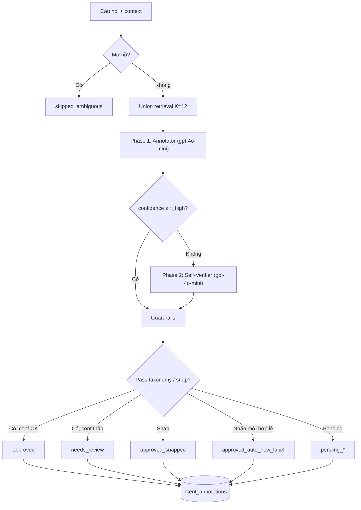

# Pipeline gán nhãn intent — Self-Verification Orchestration

Tài liệu mô tả **phương pháp gán nhãn đề xuất** và **trạng thái triển khai** trong [`data/code/intent_labeling_gpt4.ipynb`](../data/code/intent_labeling_gpt4.ipynb): gán nhãn intent 3 cấp (L1 → L2 → L3) cho QA thương mại điện tử (Hasaki), dùng **một model** (`gpt-4o-mini`) cho cả Annotator và Self-Verifier.

**Liên quan:** taxonomy, guardrail → [`LABELING_GUIDE.md`](../LABELING_GUIDE.md) · graph MongoDB → `intent_graph_rag_colab.ipynb` · rebuild catalog → [`unified_intents_rebuild.md`](unified_intents_rebuild.md)

---

## Tổng quan kiến trúc

Pipeline gồm **tiền xử lý** (retrieval từ MongoDB) + **3 phase orchestration** + **hậu kiểm rule-based** (guardrail).

```
hasaki_prelabel.json
        │
        ▼
┌─────────────────────────────────────────────────────────────┐
│  TIỀN XỬ LÝ (đã có)                                         │
│  Ambiguity filter → Graph-aware embed → Union retrieval     │
│  → top-K candidates (mặc định K=12)                         │
└────────────────────────────┬────────────────────────────────┘
                             │
                             ▼
┌─────────────────────────────────────────────────────────────┐
│  PHASE 1 — Initial Labeling (Annotator)          [ĐÃ CÓ]    │
│  GPT-4o-mini + RAG context (rubric + candidates)            │
│  → {L1, L2, L3, confidence, reasoning, is_new_label}        │
└────────────────────────────┬────────────────────────────────┘
                             │
                             ▼
┌─────────────────────────────────────────────────────────────┐
│  PHASE 3 — Confidence Routing                    [KẾ HOẠCH] │
│  confidence ≥ τ_high  → chấp nhận ngay (bỏ qua Phase 2)     │
│  confidence <  τ_high  → bắt buộc Phase 2                   │
└──────────────┬─────────────────────────┬────────────────────┘
               │ τ_high                  │ < τ_high
               ▼                         ▼
        Final label              ┌─────────────────────────────┐
        (sau guardrail)          │  PHASE 2 — Self-Verification │
                                 │  GPT-4o-mini (Verifier)      │
                                 │  → retain | revise           │
                                 │  [CHƯA CÓ trong notebook]    │
                                 └──────────────┬──────────────┘
                                                ▼
┌─────────────────────────────────────────────────────────────┐
│  HẬU KIỂM — Guardrails (rule-based)               [ĐÃ CÓ]   │
│  taxonomy snap · semantic snap · auto-create · qa_status    │
└────────────────────────────┬────────────────────────────────┘
                             ▼
              intent_annotations (MongoDB) + hasaki_labelled_*.json
```

**Điều kiện tiên quyết:** graph intent trong MongoDB (`intent_nodes`, `intent_edges`) — build từ `unified_intents.csv` qua `intent_graph_rag_colab.ipynb` §5.

---

## Phase 1 — Initial Labeling (Annotator)

**Vai trò:** GPT-4o-mini đóng vai **Annotator** — chọn **một** bộ nhãn (L1, L2, L3) phù hợp nhất.

### Input

| Thành phần | Nguồn trong hệ thống |
|------------|----------------------|
| Raw data | `sentence`, `category`, `product_name`, `brand` từ `hasaki_prelabel.json` |
| Rubric / codebook | Quy tắc taxonomy trong `build_retrieval_prompt()` (L1 ∈ `{truoc_mua_hang, sau_mua_hang}`, L2/L3 slug) |
| Few-shot / ứng viên | Top-K intent từ **union retrieval** (regex ∪ semantic), mặc định **K = 12** |

### Tiền xử lý trước Phase 1

**Bước 0 — `enrich_sample`:** gắn `domain` (`infer_domain`), `intent_id` dạng `AUTO-{sample_id}`.

**Bước 1 — Ambiguity filter:** câu quá ngắn/mơ hồ → `skipped_ambiguous`, **không** gọi LLM.

**Bước 2 — Embedding (một lần):** `embed_and_store_intent_nodes(db, force=...)` — `paraphrase-multilingual-MiniLM-L12-v2`, graph-aware text.

**Bước 3 — Union retrieval:**

| Nhánh | Hàm | Số lấy (K=12) |
|-------|-----|----------------|
| Regex | `get_candidate_l3_from_mongodb` | 6 |
| Semantic | `semantic_retrieval` (cosine ≥ 0.3) | 4 |
| Tổng sau dedupe | `union_retrieval` | ≤ 12 |

### Gọi Annotator

Hàm: `predict_intent()` → `_call_llm()` (`temperature=0`, `response_format=json_object`).

**Output JSON (Phase 1):**

```json
{
  "reasoning": "Giải thích 1–3 câu tiếng Việt (rationale)",
  "confidence": 0.87,
  "L1": "truoc_mua_hang",
  "L2": "thong_tin_san_pham",
  "L3": "chong_nuoc",
  "is_new_label": false
}
```

| Trường | Ý nghĩa (map sơ đồ) |
|--------|----------------------|
| `L1/L2/L3` | `label` (taxonomy 3 cấp) |
| `confidence` | Độ tin của Annotator ∈ [0, 1] |
| `reasoning` | `rationale` |
| `is_new_label` | Không có trong danh sách ứng viên |

**Trạng thái:** ✅ Đã triển khai (§6 notebook).

---

## Phase 3 — Confidence Routing (Cost Optimization)

**Vai trò:** Quyết định có cần **Phase 2 Self-Verification** hay chấp nhận nhãn Phase 1 ngay — cân bằng **chi phí API** vs **độ tin cậy**.

```
                    confidence từ Phase 1
                            │
              ┌─────────────┴─────────────┐
              │                           │
      confidence ≥ τ_high          confidence < τ_high
              │                           │
              ▼                           ▼
    Chấp nhận ngay                 Bắt buộc Phase 2
    (skip Self-Verifier)           (Self-Verifier)
              │                           │
              └─────────────┬─────────────┘
                            ▼
                    Guardrails → Final label
```

| Tham số đề xuất | Giá trị | Ghi chú |
|-----------------|---------|---------|
| `τ_high` (`SELF_VERIFY_SKIP_THRESHOLD`) | **0.85** | Khớp sơ đồ đề xuất; có thể chỉnh 0.80–0.90 |
| Ngưỡng approve hiện tại (code) | **0.80** | `MIN_CONF_APPROVE_EXISTING` — chỉ rule QA, **chưa** routing Phase 2 |

**Logic đề xuất:**

- **≥ τ_high:** tin Annotator → đi thẳng guardrail → `qa_status = approved` (nếu pass taxonomy).
- **< τ_high:** gọi Phase 2; sau verify mới guardrail. Có thể map `needs_review` nếu verifier vẫn thấp confidence.

**Trạng thái:** 🔶 **Chưa có** nhánh routing riêng — hiện mọi mẫu chỉ qua 1 lần LLM (Phase 1), rồi guardrail dùng ngưỡng 0.80.

---

## Phase 2 — Self-Verification (Self-Verifier)

**Vai trò:** Cùng model `gpt-4o-mini`, **prompt khác** (Verifier Mode) — đánh giá độc lập nhãn Phase 1, có thể **giữ** hoặc **sửa**.

### Input cho Verifier

| Thành phần | Nguồn |
|------------|--------|
| Rubric / codebook | Cùng quy tắc taxonomy + (tuỳ chọn) lại danh sách candidates |
| Utterance | `sentence` + context phụ |
| Predicted label | `L1, L2, L3` từ Phase 1 |
| Confidence | `confidence` Phase 1 |
| Rationale | `reasoning` Phase 1 |

### Output JSON (Phase 2 — đề xuất)

```json
{
  "decision": "retain",
  "final_label": {
    "L1": "truoc_mua_hang",
    "L2": "thong_tin_san_pham",
    "L3": "chong_nuoc"
  },
  "verification_reason": "Nhãn khớp ngữ nghĩa câu hỏi về tính năng chống nước..."
}
```

| `decision` | Hành vi |
|------------|---------|
| `retain` | `final_label` = nhãn Phase 1 |
| `revise` | `final_label` = nhãn mới (Verifier sửa L1/L2/L3) |

Sau Phase 2 → **Guardrails** (taxonomy snap, semantic snap, auto-create) áp dụng trên `final_label`.

**Trạng thái:** ❌ **Chưa triển khai** — cần thêm `verify_intent(pred, sample, candidates)` + tích hợp vào `run_batch`.

### Lợi ích (theo thiết kế)

1. **Cost optimization:** một model, hai vai; Phase 2 chỉ ~15–40% mẫu (confidence thấp).
2. **Độ tin cậy:** giảm nhầm L1 (truoc/sau), nhầm slug, overfit category.
3. **Traceability:** log đủ `reasoning` + `verification_reason` + `decision` để audit và cải prompt.

---

## Hậu kiểm — Guardrails (rule-based)

Chạy **sau** Phase 1 (hoặc sau Phase 2 nếu có) — **không** thay LLM verifier, bổ sung kiểm tra cứng.

Hàm: `save_annotation_with_guardrails()`.

```
pred / final_label
        │
        ├─ _snap_pred_to_canonical_taxonomy
        ├─ valid trong graph?
        │     ├─ Có → qa theo confidence (≥ MIN_CONF_APPROVE)
        │     └─ Không → semantic snap (cosine ≥ 0.85)
        └─ Vẫn lạ + is_new_label + conf cao
              ├─ _validate_pred_for_auto_create → upsert graph
              └─ slug sai → pending_new_label_invalid_slug
```

| `qa_status` | Điều kiện |
|-------------|-----------|
| `skipped_ambiguous` | Câu mơ hồ |
| `approved` | Nhãn trong taxonomy, conf ≥ 0.80 |
| `needs_review` | Nhãn trong taxonomy, conf &lt; 0.80 |
| `approved_snapped` | Snap semantic thành công |
| `approved_auto_new_label` | Nhãn mới hợp lệ, auto upsert graph |
| `pending_new_label_review` | Nhãn mới, conf thấp |
| `pending_new_label_invalid_slug` | Conf cao nhưng slug sai rule |

**Trạng thái:** ✅ Đã triển khai (§4 notebook).

---

## Luồng end-to-end (một câu) — mục tiêu sau khi bật Self-Verification



---

## Cấu trúc notebook

| Section | Mục đích | Liên quan orchestration |
|--------|----------|-------------------------|
| §1–§2 | Cài đặt, cấu hình, API key | Thêm biến `SELF_VERIFY_*` (kế hoạch) |
| §3 | MongoDB | — |
| §4 | Retrieval, guardrail, lưu annotation | Tiền xử lý + hậu kiểm |
| §5–§6 | LLM client, `predict_intent` | **Phase 1** |
| §6.5 *(mới)* | `verify_intent` | **Phase 2** (cần thêm) |
| §7 | Embed + test | — |
| §8 | Batch Hasaki | Tích hợp routing Phase 3 |

---

## Batch Hasaki (§8)

| Biến / file | Mô tả |
|-------------|--------|
| `HASAKI_JSON` | `{INTENT_REPO}/data/hasaki_prelabel.json` |
| `HASAKI_BATCH_SIZE` | 200 (mặc định) |
| `HASAKI_RUN_OFFSET` | Resume từ index |
| `OUTPUT_DIR` | Checkpoint + export JSON |

**Luồng hiện tại:** `enrich_sample` → `predict_intent` → `save_annotation_with_guardrails`.

**Luồng mục tiêu:**

```python
pred, raw, cands = predict_intent(sample)          # Phase 1
if pred["confidence"] < SELF_VERIFY_SKIP_THRESHOLD:
    pred = verify_intent(sample, pred, cands)      # Phase 2
ann = save_annotation_with_guardrails(db, sample, pred)
```

Export: `hasaki_labelled_full_n*_offset*.json` — bổ sung field `verification_decision`, `verification_reason` khi có Phase 2.

---

## Cấu hình

### Đã có (§2)

| Biến | Mặc định | Ý nghĩa |
|------|----------|---------|
| `USE_OPENAI` | `true` | API OpenAI |
| `OPENAI_MODEL` | `gpt-4o-mini` | Annotator (+ Verifier dùng chung) |
| `TOP_K_CANDIDATES` | `12` | Ứng viên RAG (không phải top 5) |
| `MIN_CONF_APPROVE_EXISTING` | `0.80` | Approve sau guardrail |
| `MIN_CONF_AUTO_ADD_NEW_LABEL` | `0.80` | Auto thêm node mới |
| `SEMANTIC_SNAP_TO_INTENT_THRESHOLD` | `0.85` | Snap embedding |
| `MAX_NEW_TOKENS` | `384` | Token mỗi lần gọi LLM |

### Đề xuất thêm (Self-Verification)

| Biến | Đề xuất | Ý nghĩa |
|------|---------|---------|
| `ENABLE_SELF_VERIFICATION` | `true` | Bật orchestration |
| `SELF_VERIFY_SKIP_THRESHOLD` | `0.85` | τ_high — skip Phase 2 |
| `SELF_VERIFY_MAX_TOKENS` | `256` | Token Phase 2 |

Env: [`env.sh.example`](../env.sh.example).

---

## Collections MongoDB

| Collection | Vai trò |
|------------|---------|
| `intent_nodes` | Taxonomy + embedding |
| `intent_edges` | Cây ROOT → … → INT-* |
| `intent_annotations` | Kết quả + `qa_status` (+ verification fields sau này) |

---

## Thứ tự chạy

1. Rebuild graph: `unified_intents.csv` → `intent_graph_rag_colab.ipynb` §5.
2. `embed_and_store_intent_nodes(db, force=True)` — §7.
3. Chạy §1 → §6 (Phase 1 + guardrail).
4. *(Sau khi code Phase 2)* §6.5 + batch §8.
5. Export labelled JSON.

---

## Roadmap triển khai Self-Verification

| # | Task | File / vị trí |
|---|------|----------------|
| 1 | `build_verification_prompt(sample, pred, candidates)` | §4 hoặc §6 mới |
| 2 | `verify_intent()` → parse `{decision, final_label, verification_reason}` | §6.5 |
| 3 | Routing trong `run_batch` theo `SELF_VERIFY_SKIP_THRESHOLD` | §8 |
| 4 | Lưu thêm field vào `intent_annotations` + export JSON | §4, export cell |
| 5 | A/B: so sánh quality/cost trước–sau trên subset Hasaki | script audit |

---

## So sánh: hiện tại vs mục tiêu

| Khía cạnh | Hiện tại (notebook) | Mục tiêu (sơ đồ) |
|-----------|---------------------|------------------|
| Số lần gọi LLM / mẫu | 1 (Annotator) | 1–2 (routing theo confidence) |
| Verifier | Không (chỉ rule guardrail) | GPT-4o-mini Self-Verifier |
| Ngưỡng skip verify | — | τ_high = 0.85 |
| Top-K RAG | 12 | 12 (giữ nguyên) |
| QA thấp confidence | `needs_review` | Phase 2 revise/retain + guardrail |

---

## Ghi chú

- **Top-K:** pipeline dùng **12** ứng viên (union retrieval), không phải top 5 như mô tả paper cũ.
- **Guardrail ≠ Self-Verification:** snap taxonomy / semantic là rule; Phase 2 là LLM đọc lại rationale + utterance.
- Dữ liệu đã label (`hasaki_labelled_*.json`) theo **L1/L2/L3 slug** — rebuild graph / unified_intents **không** làm mất nhãn đã gán.
- Production mặc định: **gpt-4o-mini** qua API (không cần GPU).
