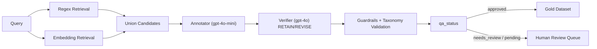

# Research Roadmap: Verification-Guided LLM Annotation Framework for Hierarchical Intent Dataset Construction

> Tài liệu điều phối nghiên cứu cho paper Scopus đầu tiên.  
> **Không** thay thế [`paper_plan.md`](paper_plan.md) (hướng Minimal Intent Prototype / retrieval representation). Hai hướng độc lập; roadmap này tập trung **dataset construction & quality assurance**.

---

## 1. Research Objective

Phát triển và đánh giá một **Verification-Guided LLM Annotation Framework** để xây dựng dataset intent phân cấp (L1–L2–L3) tiếng Việt từ dữ liệu e-commerce thực tế.

Trọng tâm:

- Xây dựng dataset chất lượng cao
- Đảm bảo chất lượng nhãn (QA) qua verification + guardrails
- Đo tác động của verification lên chất lượng nhãn, human review, và hiệu năng classifier downstream

**Không** đề xuất kiến trúc phân loại intent mới, cũng **không** đề xuất retrieval SOTA.

---

## 2. Paper Positioning

| Không phải | Là |
|------------|-----|
| New intent classification model | Verification-Guided LLM Annotation Framework |
| State-of-the-art retrieval architecture | Hierarchical Intent Dataset Construction |

**Core contribution:**

```text
Hybrid Retrieval
+ LLM Annotation (gpt-4o-mini)
+ LLM Verification (gpt-4o)
+ Guardrails / Taxonomy Validation
+ Gold Dataset Construction
```

**Câu spine (một câu):**

> We present a verification-guided LLM annotation framework that combines hybrid candidate retrieval, lightweight LLM annotation, stronger-model cross-verification, and taxonomy guardrails to construct a high-quality Vietnamese hierarchical intent dataset, and we show that verification improves label quality, reduces human review load, and benefits downstream classifiers.

---

## 3. Research Questions

| ID | Question | Evidence |
|----|----------|----------|
| **RQ1** | Does LLM-based verification improve annotation quality? | Agreement / accuracy của nhãn annotator-only vs verified trên **gold test set** (người kiểm) |
| **RQ2** | Does verification reduce the amount of human review required? | Review rate / approval rate trước vs sau verifier (phân phối `qa_status`) |
| **RQ3** | Does the verified dataset improve downstream intent classification? | Train cùng classifier (PhoBERT-base) trên Dataset A (raw) vs Dataset B (verified); đánh giá trên gold test |

---

## 4. Framework Overview



Pipeline chi tiết (notebook): [`data/code/intent_labeling_gpt4.ipynb`](../data/code/intent_labeling_gpt4.ipynb)  
Verifier design: [`docs/verifier_cross_verification_plan.md`](verifier_cross_verification_plan.md)

---

## 5. Existing Assets (đã kiểm chứng)

| Asset | Path | Ghi chú |
|-------|------|---------|
| Gold merged (`qa_status == approved`) | [`data/raw/hasaki/hasaki_labelled_approved_merged.json`](../data/raw/hasaki/hasaki_labelled_approved_merged.json) | **1702** mẫu (1603 clean approved + 99 reverified REVISE→approved) |
| Clean labelled | [`data/raw/hasaki/hasaki_labelled_clean.json`](../data/raw/hasaki/hasaki_labelled_clean.json) | **2011** mẫu: approved 1603, approved_auto_new_label 158, needs_review 81, pending_new_label_review 169 |
| Full labelled | [`data/raw/hasaki_labelled_full.json`](../data/raw/hasaki_labelled_full.json) | **2043** mẫu (+ pending_new_label_invalid_slug 25, no_intent 7) |
| Human-review reverify (before/after) | [`data/audit/hasaki_labelled_clean_human_review_reverified (1).json`](../data/audit/hasaki_labelled_clean_human_review_reverified%20(1).json) | **250** mẫu; có `qa_status_before_reverify`, `intent_3_level_before_reverify` |
| Taxonomy CSV | [`data/unified_intents.csv`](../data/unified_intents.csv) | Intent nodes thống nhất |
| Intent graph nodes/edges | [`data/intent_kb.intent_nodes_27_05_2026.csv`](../data/intent_kb.intent_nodes_27_05_2026.csv), [`data/intent_kb.intent_edges_28_05_2026.csv`](../data/intent_kb.intent_edges_28_05_2026.csv) | Graph MongoDB export |
| Labeling pipeline | [`data/code/intent_labeling_gpt4.ipynb`](../data/code/intent_labeling_gpt4.ipynb) | Annotate + verify + guardrail; `VERIFY_ALL_SAMPLES`, `apply_verifier(force=)`, `persist=` |
| Retrieval / embeddings | [`intent_graph_rag_colab.ipynb`](../intent_graph_rag_colab.ipynb) | Regex + semantic union retrieval |
| Phase 1 sơ bộ | [`notebooks/dataset_evaluation.ipynb`](../notebooks/dataset_evaluation.ipynb), [`data/audit/intent_distribution.csv`](../data/audit/intent_distribution.csv) | Audit phân phối intent |
| Verifier report script | [`scripts/generate_verifier_report.py`](../scripts/generate_verifier_report.py) | Báo cáo RETAIN/REVISE / qa_status |
| Split script | [`scripts/make_splits.py`](../scripts/make_splits.py) | Stratified train/val/test |
| Experiment index | [`experiments/README.md`](../experiments/README.md) | Chỉ mục notebook/script theo phase |

### Thống kê gold hiện tại (approved merged)

| Metric | Value |
|--------|------:|
| Samples | 1702 |
| L1 classes | 2 (`truoc_mua_hang` 1345, `sau_mua_hang` 357) |
| L2 classes | 37 |
| L3 classes | 197 |
| L3 với count = 1 | 42 |
| L3 với count < 3 | 68 |

→ Long-tail mạnh; split phải **stratify L3, fallback L2** cho lớp hiếm.

---

## 6. Gaps & How to Close Them

| Gap | Ảnh hưởng | Cách lấp (Phase 0) |
|-----|-----------|---------------------|
| Verifier mới chạy trên **250** mẫu human-review, chưa chạy toàn bộ ~2000 mẫu | Không có cặp nhãn annotator-only vs verified trên cùng tập → yếu RQ1/RQ3 | Chạy `VERIFY_ALL_SAMPLES=1` trên toàn bộ clean/full |
| Chưa có **gold test set do người kiểm** | Không có chuẩn độc lập để đo chất lượng nhãn | Xây ~250–300 mẫu stratified, người kiểm → `data/gold/test_gold.json` |
| Chưa freeze train/val/test | Kết quả không tái lập giữa các phase | `scripts/make_splits.py` → `data/splits/` |
| Dataset A/B chưa khớp `sample_id` | So sánh train A vs B không công bằng | Sinh A/B từ cùng run full-verify, cùng split IDs |

---

## 7. Phase 0 — Data Completion (unblock RQ1 / RQ3)

Phase này **bắt buộc** trước khi chạy Phase 5–6 và ablation có ý nghĩa thống kê.

### 7.1 Full verification pass

**Mục tiêu:** mỗi mẫu có cặp nhãn:

| Field | Ý nghĩa |
|-------|---------|
| `intent_3_level_annotator` / `confidence_before_verify` | Nhãn + conf từ gpt-4o-mini (trước verify) |
| `verifier_decision` | `RETAIN` / `REVISE` |
| `intent_3_level` | Nhãn sau verify + guardrail |
| `qa_status` | Trạng thái QA cuối |

**Quy trình:**

1. Mở [`data/code/intent_labeling_gpt4.ipynb`](../data/code/intent_labeling_gpt4.ipynb).
2. Chạy setup §1–§7 (MongoDB, retrieval, `apply_verifier`, guardrails).
3. Đặt môi trường:
   ```bash
   export VERIFY_ALL_SAMPLES=1
   export ENABLE_VERIFIER=1
   export VERIFIER_MODEL=gpt-4o
   ```
4. Chạy batch trên toàn bộ nguồn (~2000 mẫu từ clean hoặc full).
5. Export JSON, ví dụ:
   - `data/raw/hasaki/hasaki_labelled_full_verified.json` — mọi mẫu + metadata verifier
6. (Tuỳ chọn) dry-run reverify §8.6 nếu chỉ cần subset; **Phase 0 yêu cầu full pass**, không chỉ 250 human-review.

**Output kỳ vọng:**

- `data/raw/hasaki/hasaki_labelled_full_verified.json`
- Báo cáo: `python scripts/generate_verifier_report.py --input <file> --outdir data/audit`

### 7.2 Xây Dataset A và Dataset B (khớp mẫu)

Từ file full-verified:

| Dataset | Định nghĩa | Dùng cho |
|---------|------------|----------|
| **A (raw)** | Nhãn annotator-only (`intent_3_level` trước verify / `confidence_before_verify` path) trên **cùng** `sample_id` | Train classifier “noisy” |
| **B (verified)** | Nhãn sau verify+guardrail với `qa_status == "approved"` | Train classifier “clean” |

**Ràng buộc phương pháp:**

- A và B dùng **cùng danh sách `sample_id` train** (intersection: mẫu có cả nhãn A và được approve ở B; hoặc train B trên approved, train A trên cùng IDs với nhãn annotator).
- **Gold test set tách biệt**, không nằm trong train của A hay B.
- Ghi rõ seed, model version, prompt version trong metadata export.

Khuyến nghị thực tế:

1. Lấy tập `sample_id` có `qa_status == "approved"` sau full-verify → đây là pool cho Dataset B.
2. Dataset A = cùng `sample_id`, nhưng gán nhãn = annotator prediction (trước verify).
3. Split train/val theo `scripts/make_splits.py` trên pool B; áp dụng **cùng ID split** cho A.

### 7.3 Gold test set (người kiểm)

| Thuộc tính | Giá trị |
|------------|---------|
| Kích thước | **250–300** mẫu |
| Sampling | Stratified theo **L1** và **L2** (ưu tiên phủ L2; L3 long-tail lấy tối đa có thể) |
| Nguồn pool | Subsample từ full-verified (hoặc clean), **ưu tiên** mẫu có `verifier_decision == REVISE` + mẫu RETAIN + mẫu needs_review để đa dạng lỗi |
| Annotator | Người (domain e-commerce / nghiên cứu viên), có taxonomy L1–L2–L3 |
| Output | `data/gold/test_gold.json` |

Schema đề xuất mỗi mẫu:

```json
{
  "sample_id": "...",
  "sentence": "...",
  "intent_3_level": {
    "level_1": "...",
    "level_2": "...",
    "level_3": "..."
  },
  "annotator_id": "human_01",
  "notes": ""
}
```

**Quy tắc chống rò rỉ:** mọi `sample_id` trong `test_gold.json` bị loại khỏi train/val của Phase 3–6.

### 7.4 Freeze splits

```bash
python scripts/make_splits.py \
  --input data/raw/hasaki/hasaki_labelled_approved_merged.json \
  --outdir data/splits \
  --seed 42 \
  --train-ratio 0.7 \
  --val-ratio 0.15 \
  --test-ratio 0.15
```

Sau khi có full-verified + gold test:

- Chạy lại `make_splits.py` trên pool Dataset B, **loại** IDs trong `test_gold.json`.
- Hoặc: dùng gold test làm test cố định; `make_splits` chỉ tạo train/val trên phần còn lại.

Output: `data/splits/train.json`, `val.json`, `test.json` (+ `split_meta.json`).

---

## 8. Phase 1 — Dataset Analysis

**Mục tiêu:** mô tả dataset cho paper (bảng + hình).

**Tasks:**

- Số mẫu (raw / approved / gold)
- Số intent L1 / L2 / L3
- Phân phối intent (bar / histogram)
- Long-tail analysis (L3 count distribution, % lớp < 5 mẫu)
- Độ dài câu trung bình (ký tự / token ước lượng)
- Train / val / test sizes sau split

**Reuse:** mở rộng [`notebooks/dataset_evaluation.ipynb`](../notebooks/dataset_evaluation.ipynb) — đổi nguồn mặc định sang `hasaki_labelled_approved_merged.json` và/hoặc full-verified.

**Outputs:**

- Bảng thống kê (Markdown / LaTeX)
- `data/audit/intent_distribution.csv` (cập nhật)
- Plots: `data/audit/class_distribution_l1.png`, `l2.png`, `l3_top50.png`, `sentence_length_distribution.png`

---

## 9. Phase 2 — Retrieval Evaluation

**Mục tiêu:** chứng minh hybrid retrieval cải thiện candidate coverage (hỗ trợ framework, không phải contribution chính).

**Methods:**

| ID | Method |
|----|--------|
| R1 | Regex only |
| R2 | Embedding only |
| R3 | Hybrid (union) |

**Metrics:** Recall@1, Recall@3, Recall@5, Recall@10, MRR

**Gold label:** L3 path từ gold test hoặc từ approved labels (ghi rõ trong paper).

**Reuse:** logic trong [`intent_graph_rag_colab.ipynb`](../intent_graph_rag_colab.ipynb) + embedding hiện tại (`paraphrase-multilingual-MiniLM-L12-v2`).

**Output:** `experiments/phase2_retrieval/` (notebook hoặc script + bảng kết quả).

---

## 10. Phase 3 — Intent Classification Benchmark

**Tasks:**

| Task | Label space |
|------|-------------|
| A | L1 classification |
| B | L2 classification |
| C | L3 classification |

**Metrics:** Accuracy, Macro-F1, Weighted-F1  
**Primary metric:** **Macro-F1** (phù hợp long-tail)

**Data:** train/val/test từ `data/splits/` + gold test nếu tách riêng.

---

## 11. Phase 4 — Baseline Models

### Classical

- TF-IDF + SVM
- FastText

### Transformer (fine-tune)

- PhoBERT-base
- PhoBERT-large
- XLM-R-large

### Embedding-based (training-free)

```text
Embedding → Nearest Intent Prototype
```

Encoders: multilingual-e5-large, BGE-M3, jina-embeddings-v3

### LLM-based

- GPT-4o-mini, GPT-4o
- Modes: zero-shot, few-shot (k cố định, cùng exemplars trên mọi run)

**Output:** bảng so sánh Macro-F1 theo Task A/B/C.

---

## 12. Phase 5 — Pipeline Evaluation

Đánh giá framework annotation như một hệ thống end-to-end (so với gold test).

| Method | Pipeline |
|--------|----------|
| **M1** | Query → GPT-4o-mini (direct, no retrieval) |
| **M2** | Query → Hybrid Retrieval → GPT-4o-mini |
| **M3** | Query → Hybrid Retrieval → GPT-4o-mini → GPT-4o Verifier |

**Metrics:**

| Metric | Định nghĩa |
|--------|------------|
| Accuracy / Macro-F1 | So với gold test (L3 primary; báo cáo thêm L1/L2) |
| Review Rate | Tỷ lệ mẫu `needs_review` ∪ `pending_*` sau guardrail |
| Approval Rate | Tỷ lệ `qa_status == approved` |

**Liên hệ RQ:**

- M2 vs M1 → lợi ích retrieval (phụ)
- M3 vs M2 → lợi ích verification (**RQ1**, **RQ2**)

---

## 13. Phase 6 — Dataset Quality Evaluation (bằng chứng cốt lõi)

**Giả thuyết:** Verified Dataset (B) > Raw Dataset (A) khi train cùng classifier.

| Item | Spec |
|------|------|
| Model | PhoBERT-base (cùng hyperparams, seed) |
| Train A | Nhãn annotator-only, cùng `sample_id` train |
| Train B | Nhãn verified-approved, cùng `sample_id` train |
| Eval | `data/gold/test_gold.json` |
| Metrics | Macro-F1, Accuracy, Weighted-F1 (L3 primary) |

Đây là thí nghiệm **mạnh nhất** hỗ trợ paper (RQ3).

**Phân tích bổ sung (khuyến nghị):**

- Confusion: lỗi A sửa được bởi B
- Hiệu năng theo head vs tail classes
- Correlation: mẫu REVISE bởi verifier có giúp B hơn không

---

## 14. Ablation Study

| Config | Components |
|--------|------------|
| Abl-1 | Annotation only (direct LLM) |
| Abl-2 | Annotation + Retrieval |
| Abl-3 | Annotation + Retrieval + Verification |
| Abl-4 | Annotation + Retrieval + Verification + Guardrails |

**Measure:** Macro-F1 (vs gold test), Approval Rate, Human Review Rate

Abl-4 là full framework; so sánh incremental gains.

---

## 15. Experiment Matrix (tóm tắt)

| Phase | Primary question | Key metric | Depends on |
|-------|------------------|------------|------------|
| 0 | Data ready? | Full-verified file + gold test | Pipeline notebook |
| 1 | What is the dataset? | Stats tables / plots | Gold / approved |
| 2 | Does hybrid help coverage? | Recall@K, MRR | Gold labels + retrieval |
| 3–4 | How hard is classification? | Macro-F1 L1/L2/L3 | Splits |
| 5 | Does the pipeline work? | Macro-F1, Review Rate | Gold test |
| 6 | Does verification improve data? | Macro-F1(B) − Macro-F1(A) | Dataset A/B + gold test |
| Ablation | Which component matters? | Macro-F1, Review Rate | Gold test |

---

## 16. Methodological Notes (reproducibility)

1. **Dataset A/B** phải khớp `sample_id` và cùng split.
2. **Gold test** do người kiểm; không dùng nhãn LLM làm “gold” khi đo RQ1/RQ3.
3. Ghi lại: `seed`, `ANNOTATOR_MODEL`, `VERIFIER_MODEL`, `VERIFY_CONF_THRESHOLD` / `VERIFY_ALL_SAMPLES`, embedding model, prompt version (hash hoặc ngày).
4. Không train trên mẫu thuộc gold test.
5. Báo cáo cả head và tail performance khi có thể (Macro-F1 đã phạt long-tail).

---

## 17. Expected Paper Structure

1. Introduction
2. Related Work (LLM-assisted annotation, verification / self-consistency, hierarchical intent, Vietnamese NLP)
3. Methodology
   - Taxonomy (L1–L2–L3)
   - Hybrid Retrieval
   - LLM Annotation
   - LLM Verification
   - Guardrails
4. Experimental Setup
5. Results (RQ1–RQ3)
6. Ablation Study
7. Discussion (limitations: cost, long-tail, no full human gold on all data)
8. Conclusion

---

## 18. Target Venues

| Priority | Venue |
|----------|-------|
| Primary | International Conference on Knowledge and Systems Engineering (KSE) |
| Primary | International Symposium on Information and Communication Technology (SoICT) |
| Primary | Future Data and Security Engineering Conference (FDSE) |

**Goal:** First Scopus-indexed conference paper, trước khi mở rộng novelty cao hơn (có thể kết hợp sau với hướng Minimal Prototype trong [`paper_plan.md`](paper_plan.md)).

---

## 19. Suggested Timeline

| Week | Focus |
|------|--------|
| 1 | Phase 0: full verify + export A/B metadata; draft gold sampling list |
| 2 | Phase 0: human gold test (250–300); freeze splits |
| 3 | Phase 1 stats + Phase 2 retrieval eval |
| 4 | Phase 3–4 baselines (classical + PhoBERT-base first) |
| 5 | Phase 5 pipeline M1/M2/M3 + Phase 6 A vs B |
| 6 | Ablation + error analysis + paper draft |
| 7 | Polish tables/figures; submit |

Điều chỉnh theo deadline venue cụ thể.

---

## 20. Asset → Phase Mapping

| Phase | Primary assets |
|-------|----------------|
| 0 | `intent_labeling_gpt4.ipynb`, clean/full JSON, `generate_verifier_report.py` |
| 1 | `dataset_evaluation.ipynb`, approved_merged / full_verified, `unified_intents.csv` |
| 2 | `intent_graph_rag_colab.ipynb`, intent_kb nodes/edges, gold labels |
| 3–4 | `data/splits/`, gold test |
| 5 | Pipeline notebook (M1–M3 configs), gold test |
| 6 | Dataset A/B from full_verified, PhoBERT, gold test |
| Ablation | Same as Phase 5 with component flags |

---

## 21. Immediate Next Actions

1. Chạy full verification (`VERIFY_ALL_SAMPLES=1`) → `hasaki_labelled_full_verified.json`.
2. Sample + human-label gold test → `data/gold/test_gold.json`.
3. Freeze splits: `python scripts/make_splits.py` (đã có script).
4. Cập nhật Phase 1 notebook sang nguồn approved/full_verified.
5. Implement Phase 2 harness trong `experiments/phase2_retrieval/`.

Chỉ mục thí nghiệm: [`experiments/README.md`](../experiments/README.md).
)